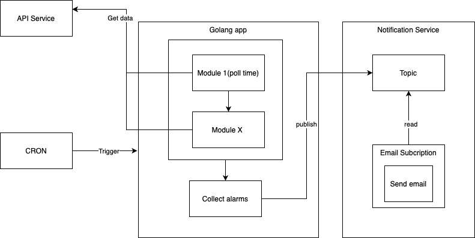
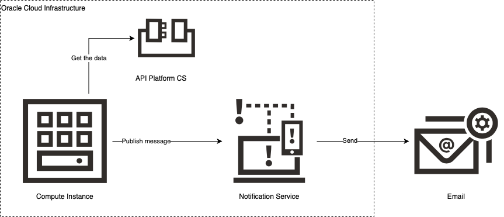

# API Platform CS monitoring

## Overview

OCI Cloud Native services come with seemingly integrated Monitoring service. But what if a bit older services, like API Platform CS, are used? There are a few approaches that can be utilized, depending on the metrics we are interesting in.

This repo showcases one of the approaches, based on the REST APIs exposed by the API Platform service. It's by no means the complete solution, just a demo to get a feel of a concept.

## Functionality

1. Application checks the last polling time for the list of configured gateways
2. If defined threshold is not met for any of them - email notification is sent to defined receipients

## Architecture

## Deployment Architecture

Please note that monitoring part of the solution can be deployed free of cost for many use cases:
1. Compute Node - Oracle Free Tier can be utilized.
2. Notification Service - first 1000 emails per month free. See this [link](https://www.oracle.com/cloud/systems-management/notifications/pricing.html) for details.

## Installation

### Prerequisites

1. Install and configure [CLI](https://docs.cloud.oracle.com/en-us/iaas/Content/API/Concepts/cliconcepts.htm)
2. Download [SDK for GO](https://docs.cloud.oracle.com/en-us/iaas/Content/API/SDKDocs/gosdk.htm)
3. Configure Notification Service:
    1. Create Topic. This can be done in the OCI Console or using CLI: `oci ons topic create --name <name of topic> --compartment-id <id of compartment>`
    2. Create Subscritpion. This can be done in the OCI Console or using CLI: `oci ons subscription create --topic-id <id of created topic> --compartment-id <id of compartment> --protocol email --subscription-endpoint <address to which email is going to be sent>`
    
 
